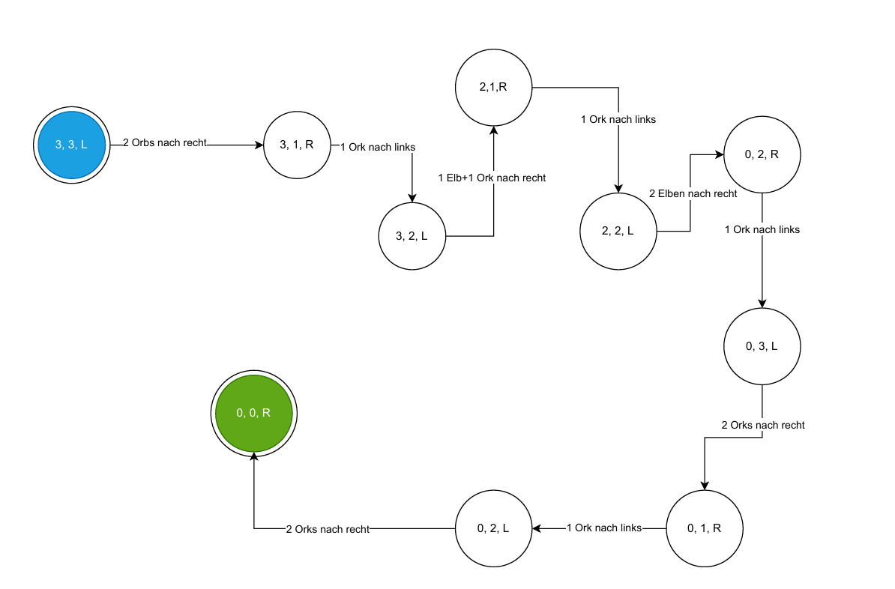

# Search.01: Problemformalisierung, Zustandsraum

1. Formalisieren Sie das Problem (Zustände, Aktionen, Start- und Endzustand).

### Zustandsrepräsentation

Zustände werden als **Tripel** der Form
**
(EL, OL, P)
**  
repräsentiert, wobei:

- **EL**: Anzahl der Elben auf der linken Seite
- **OL**: Anzahl der Orken auf der linken Seite
- **P**: Position des Pferdes
    - **L** = links
    - **R** = rechts

### Mögliche Aktionen

Eine Aktion besteht darin, das Pferd mit folgendem zu überqueren lassen:

- 1 Elb allein
- 1 Ork allein
- 2 Elben
- 2 Orks
- 1 Elb + 1 Ork

### Start-Zuständ
**
(33G)
**

### End-Zustand
**
(00D)
**

2. Skizze des Problem-graphs
   

# Search.02: Vergleich von Tiefensuche, Breitensuche und A*
**Start:** Würzburg  
**Ziel:** München

## 1. Tiefensuche (DFS – mit Stack, Graph-Search)

### Start:
Stack = [Würzburg]

| Schritt | Stack                    | Markierten Knoten           |
|---------|--------------------------|-----------------------------|
| 1       | [Wü]                     | -                           |
| 2       | [WüEr, WüFr, WüNü]       | Wü                          |
| 3       | [WüFr, WüNü]             | -                           |
| 4       | [WüFrKa, WüFrMa, WüNü]   | Wüzrburg, Frankfurt         |
| 5       | [WüFrKaMü, WüFrMa, WüNü] | Wüzrburg, Frankfurt, Kassel |

**Gefundener Weg (DFS):**  
Würzburg → Frankfurt → Kassel → München  
**Gesamtkosten:** 217 + 173 + 502 = **892 km**

## 2. Breitensuche (BFS – mit Queue, Graph-Search)

### Regel:
- Verwende eine **Queue (FIFO)**.
- Nachbarn alphabetisch einfügen.
- Keine Wiederholungen.

### Start:
Queue = [Würzburg]

| Schritt | Queue (links = vorne)                | Markierten Knoten                              |
|---------|--------------------------------------|------------------------------------------------|
| 1       | [Wü]                                 | -                                              |
| 2       | [WüEr, WüFr, WüNü]                   | Würzburg                                       |
| 3       | [WüFr, WüNü]                         | -                                              |
| 4       | [WüNü, WüFrKa, WüFrMa]               | Würzburg, Frankfurt                            |
| 5       | [WüFrKa, WüFrMa, WüNüMü, WüNüSt]     | Würzburg, Frankfurt, Nünberg                   |
| 6       | [WüFrMa, WüNüMü, WüNüSt, WüFrKaMü]   | Würzburg, Frankfurt, Nünberg, Kassel           |
| 7       | [WüNüMü, WüNüSt, WüFrKaMü, WüFrMaKa] | Würzburg, Frankfurt, Nünberg, Kassel, Mäünchen |

**Gefundener Weg (BFS):**  
Würzburg → Nürnberg → München  
**Gesamtkosten:** 103 + 167 = **270 km**

## 3. A*-Suche (Tree-Search ohne Zyklen, sortierte Queue)

### Regel:
- f(n) = g(n) + h(n)
- g(n): bisherige Kosten
- h(n): Heuristik zum Ziel
- Wähle immer den Knoten mit kleinstem f(n).
- Keine Wiederholung von bereits besuchten Städten.

### Schritt 1: Expand Würzburg
Nachbarn:
- Erfurt: g=186, h=400 → f=586
- Frankfurt: g=217, h=100 → f=317
- Nürnberg: g=103, h=537 → f=640

**Offene Liste (sortiert nach f):**  
[(Frankfurt,317), (Erfurt,586), (Nürnberg,640)]
---
### Schritt 2: Expand Frankfurt (f=317)
Nachbarn:
- Mannheim: g=217+85=302, h=200 → f=502
- Kassel: g=217+173=390, h=460 → f=850  
  (Würzburg ist bereits besucht)

**Offene Liste:**  
[(Mannheim,502), (Erfurt,586), (Nürnberg,640), (Kassel,850)]

---
### Schritt 3: Expand Mannheim (f=502)
Nachbarn:
- Karlsruhe: g=302+80=382, h=10 → f=392

**Offene Liste:**  
[(Karlsruhe,392), (Erfurt,586), (Nürnberg,640), (Kassel,850)]

---
### Schritt 4: Expand Karlsruhe (f=392)
Nachbarn:
- Augsburg: g=382+250=632, h=0 → f=632

**Offene Liste:**  
[(Erfurt,586), (Augsburg,632), (Nürnberg,640), (Kassel,850)]

---
### Schritt 5: Expand Erfurt (f=586)
Nachbarn: keine neuen relevanten (bereits besucht)

**Offene Liste:**  
[(Augsburg,632), (Nürnberg,640), (Kassel,850)]
---
### Schritt 6: Expand Augsburg (f=632)
Nachbarn:
- München: g=632+84=716, h=0 → f=716

**Offene Liste:**  
[(Nürnberg,640), (München,716), (Kassel,850)]

---
### Schritt 8: Expand **München (f=270)** 

**!! Ziel erreicht !!**

**Gefundener Weg (A\*):**  
Würzburg → Nürnberg → München  
**Gesamtkosten g = 270 km**  
**f(Ziel) = 270**

#### Vergleich der Algorothmen

| Algorithmus              | Struktur        | Gefundener Pfad                         | Gesamtkosten (km) | Iterationen | Bemerkung                                                  |
|--------------------------|-----------------|-----------------------------------------|-------------------|-------------|------------------------------------------------------------|
| Tiefensuche (DFS)        | Stack           | Würzburg → Frankfurt → Kassel → München | 892               | 6           | Tiefensuche folgt tiefster Route zuerst, oft nicht optimal |
| Breitensuche (BFS)       | Queue           | Würzburg → Nürnberg → München           | 270               | 5           | Garantiert kürzesten Weg (bei gleicher Kantenlänge)        |
| A* (zulässige Heuristik) | Sortierte Queue | Würzburg → Nürnberg → München           | 270               | 8           | Optimal, prüft aber zusätzlich Heuristikwerte              |

### Dürfen die gegebenen h(n) verwendet werden?

Nein, nicht alle so wie gegeben.

Eine Heuristik darf in A* nur verwendet werden, wenn sie **zulässig** ist, d.h. für jeden Knoten n:

*h(n) ≤ (tatsächliche minimalen Kosten von n nach München)*

Vergleich mit den gegebenen h(n):

- Alle h(n) sind <= jeweiliger kürzester Distanz — **außer für Nürnberg**:
  - Gegeben: h(Nünberg) = 537
  - Tatsächlich: 167

⇒ 537 > 167, also überschätzt —> **nicht zulässig**.

**Antwort**: Die Abschätzungen dürfen **nicht verwendet werden**, weil h(Nünberg) 
die wahren Kosten überschätzt und somit die **Zulässigkeitsbedingung verletzt**.

### Wie müssen die Abschätzungen ggf. korrigiert werden?

**Prinzip**: Für jede Stadt *n* muss gelten:  
h(n) <= g(n) mit g(n)
(d.h. kleiner oder gleich der echten kürzesten Distanz nach München).

**Korrektur für dieses Problem**: setze h(Nünberg <= 167.
(oder jede kleinere Zahl ≤ 167). Alle anderen gegebenen Werte sind bereits zulässig.

### A* erneut ausführen mit korrigiertem h(Nünberg = 167.

Wir zeigen die **Hand-Simulation** der A*-Suche (Tree-Search ohne Zyklen) – mit den relevanten \(f\)-Berechnungen.

**Start**:  
Würzburg, g=0, h=170 -> f=170.
`Open = (Würzburg, f = 170)`

##### Schritt 1 — Würzburg expandieren

**Nachbarn**:
- Erfurt: g=186, h=400 -> f=586.
- Frankfurt: g=217, h=100 -> f=317.
- Nürnberg: g=103, h=167 -> f=270.

**Open (sortiert nach f(n) )**:  
`(Wu_Nü, 270)`, `(Wü_Fr, 317)`, `(Wü_Er, 586)`

---
#### Schritt 2 — Nürnberg expandieren

**Nachbarn**:
- München: g=103 + 167 = 270, h=0 -> f=270.

**Open (neu sortiert)**:  
`(Wu_Nü_Mü, 270)`, `(Wü_Fr, 317)`, `(Wü_Er, 586)`

#### Schritt 3 — München expandieren → Ziel extrahiert ⇒ **Stopp**

**Gefundener Pfad**: `Würzburg → Nürnberg → München`  
**Gesamtkosten**: g(Mü) = 270 km

# Search.03: Dominanz

#### Bedeutung

Eine Heuristik **h1** wird gesagt, **h2** zu dominieren,  
wenn sie gleich oder größer ist als **h2** für alle Zustände *n*, und **beide Heuristken zulässig** 
sind.

*Anders gesagt :*
    **h1** liefert eine mindestens so gute oder bessere Schätzung der Restkosten als **h2**

#### Wirkung in A\*

Wenn A\* mit einer **dominierenden Heuristik h1** arbeitet:

+ Es wird **weniger Knoten** expandiert.
- Die Suche ist **effizienter**
- Das Ergebnis bleibt **optimal**, solange **h1** zulässig ist.

Im Vergleich zu **h2**:
- Mit einer **schwächeren Heuristik** **h2** (die von **h1** dominiert wird)  
  muss A\* **mehr Zustände durchsuchen**, um die gleiche optimale Lösung zu finden.

#### Beispiel

Wenn man **h1** (die Luftliniendistanz) verwendet,  
unterschätzt diese Heuristik oft die tatsächliche Entfernung,  
weil man in Wirklichkeit **nicht direkt** gehen kann (es gibt Straßen, Kurven, Hindernisse).

> **Ergebnis**: 
A\* glaubt, dass **viele verschiedene Wege fast gleich gut** sind,  
und muss daher **mehr Knoten expandieren**, um so bessere Wege zu finden.

Mit **h2** (die Straßendistanz)  
ist der Wert **näher an den tatsächlichen Kosten**,  
also verwirft A* **früher unnötige Wege**. 

> Dadurch werden **weniger Knoten untersucht**,  
und die **gleiche optimale Lösung** wird **schneller** gefunden.

# SEARCH.04: Beweis der Optimalität von A* (Tree-Search)

> Eine Voraussetzung ist, dass die Heuristik **h(n)** zulässig ist (überschätzt nie die tatsächlichen Kosten).

#### Prinzip von A\*

- A* wählt immer den Knoten **n** mit dem kleinsten f(n) = g(n) + h(n) aus der offenen Liste.

#### Beweisidee
- Angenommen, es gäbe eine **bessere Lösung S\* mit g(S\*)<g(S)**.
- Da **h(n)** **zulässig** ist, gilt für jeden Knoten auf dem optimalen Pfad:
  **f(n)<=g(S\*)**
- A\* würde diese Knoten **zuerst expandieren**, bevor eine teurere Lösung akzeptiert wird.

**Schlussfolgerung :**
A* findet immer die optimale Lösung, solange die Heuristik zulässig ist.